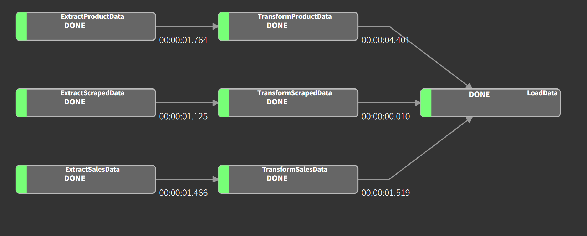

# ***Creating a Simple ETL Pipeline with LUIGI***

Hi there!, Welcome to my project. In this guide, I will explain how to develop a simple ETL pipeline based on a common use case

---

# Project Background
**A company wants to improve its sales performance by embarking on a digital transformation. To achieve this, they need to enhance data quality to enable more effective analysis and decision-making**

Based on this background, we can begin building the solution by following these steps:

# 1. Requirement Gathering
During the requirements gathering stage, I discussed with users and key stakeholders to understand the following:

- **Understanding how the business works**, including business workflows and overall operations.

- **Assessing the source data condition**, including data quality checks, validation, and data format.

- **Evaluating the business situation** to determine if implementation is feasible at this time and whether the company has sufficient budget

---

### User Problem
After discussing with the user, it turns out that the user has the following problem:

- The Marketing team wants to analyze the sales performance of electronic products over the past 2 years. However, **the sales data is scattered across various sources, including databases and CSV files with inconsistent and messy contents. Many values are missing, and the formatting is inconsistent**.

- The Data Science team aims to build a Natural Language Processing (NLP) model to analyze market trends for electronic products. However, **the current data is insufficient for model building, poorly structured, and contains many missing values. Additionally, the team needs supplementary data from online sources, such as product reviews and descriptions, which they currently do not have**. 

### Main Problem

Based on the issues identified by users, there are 3 main problems:

- **Scattered Data**: Data is fragmented across different sources, including the database and CSV files.

- **Data Quality Issues**: The source data is messy, contains many missing values, and has inconsistent formatting.

- **Lack of Data for Research**: The Data Science team lacks sufficient data to build NLP models and needs additional data from online sources for effective analysis.

---

# 2. Proposed Solution
After understanding how the business operates, the condition of the data sources, and the main problems, **the next step is to discuss with the user to propose solutions and methods that are suitable for the company's current conditions**. Here's the proposed solution:

- **Data Integration**: Integrate all data into a centralized data warehouse to provide a single source of truth.

- **Data Quality Improvement**: Implement data cleaning and transformation processes to handle missing values and ensure data consistency across all sources.

- **Supplementary Data Collection**: Use web scraping techniques to gather additional data required by the Data Science team for NLP modeling.

- **Automated ETL Pipeline**: Develop an automated ETL (Extract, Transform, Load) pipeline using LUIGI to ensure that data is consistently updated and accessible to all relevant teams.

# 3. Implement a Solution
 Once the users and stakeholders agree with the proposed solution, we can proceed to implement it.

### - Create ETL Pipeline

- **Extract**: Read data from each source and save it to a CSV file.

- **Transform**: Validate, clean, and transform each dataset based on user requirements.

- **Load**: Load all transformed data into a single data warehouse

---

**Transformation requirements**
    
After discussing the data source conditions with each user, they provided requirements for handling and transforming each data source, here's the requirements:

- [Product data transformation requirements](https://github.com/Rico-febrian/simple-etl-with-luigi/blob/main/user_requirements/product_data_requirements.txt)
- [Sales data transformation requirements](https://github.com/Rico-febrian/simple-etl-with-luigi/blob/main/user_requirements/sales_data_requirements.txt)
- [Scraped data transformartion requirements](https://github.com/Rico-febrian/simple-etl-with-luigi/blob/main/user_requirements/scraped_data_requirements.txt)

---
  
## - Integrate and Automate ETL Pipeline 

- **Data Integration**: The Load task in the ETL process integrates data from various sources into a single data warehouse, ensuring that all teams have easy access to the necessary information.

- **Automated Data Updates**: Set up automatic scheduling with "crontab" for ETL processes to ensure that the data in the database is consistently updated. [ETL Pipeline Script for Automate](https://github.com/Rico-febrian/simple-etl-with-luigi/blob/main/etl_pipeline.sh)

---

## - Web Scraping

**!! DISCLAIMER! !**

**INFORMATION FROM WEB SCRAPING IS ONLY DONE FOR LEARNING PURPOSES, NOT FOR CRIMINAL ACTIVITIES**

Scrape data from websites that provide information related to electronic products or sales, as required by the Data Scientist team. In this project, data was scraped from the e-commerce website, Aliexpress.com.

**ALWAYS CHECK THE TERM & CONDITIONS OF A WEBSITE BEFORE DO A WEB SCRAPING!**

**[!! CHECK THIS BEFORE SCRAPING !!](https://webscraping.ai/faq/aliexpress-scraping/is-there-a-limit-to-the-amount-of-data-i-can-scrape-from-aliexpress#:~:text=Terms%20of%20Service%3A%20Before%20you,the%20service%20you%20are%20using.)**

---

## - How the ETL Pipeline Works

The ETL pipeline invlolves several key tasks:

**Extract**
- Extract Product Data
- Extract Sales Data
- Extract Scraped Sata

This task will extract data from each source and save the output into CSV files. 

**Transform**
- Transform Product Data
- Transform Sales Data
- Transform Scraped Data

This task will validate, clean, and transform data based on the user requirements.

**Load**
- Load data

This final task will load the transformed data into a data warehouse.

[Full ETL Pipeline Code](https://github.com/Rico-febrian/simple-etl-with-luigi/blob/main/etl.py#L12)

***ETL Dependency Graph***

---

## - Testing Scenario
To test the robustness of the ETL pipeline, we will perform an UPSERT process. In this scenario, new data will be added to the sales database. This test will ensure that the ETL pipeline operates according to its schedule and can successfully retrieve and integrate the latest data.

- Add New Data: Insert new data into the sales database.

- Check Data Warehouse Before Update: Verify the current state of the data warehouse before performing updates.

- Modify Load Task: Adjust the Load task to ensure it updates the data warehouse with the new data.

- Check Updated Data Warehouse: Verify the data warehouse after the update to confirm that the new data has been correctly integrated.

Data warehouse **before adding a new record** in the sales database.

Data warehouse **after upsert**

---

# - Tools
The following tools were used to create this project:

- Python
- Pandas
- Playwright
- Pangres
- Luigi
- Docker
- PostgreSQL
